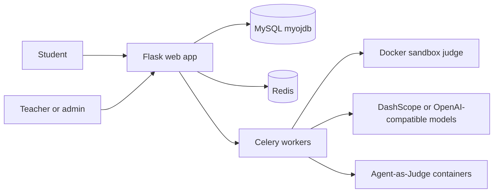
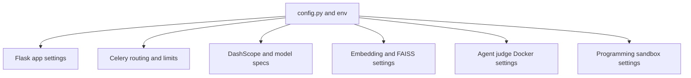

# Project Overview

NumericalOJ is an educational online judge for programming and mathematical coursework. Its center is a Flask application that serves a Chinese user interface and JSON APIs, while Celery workers run the slower and riskier jobs: programming judging, AI agents, written-homework grading, repository indexing, AI-code detection, and ranking-competition evaluation. The product is broader than a classic ACM-style judge. It combines class assignments, per-student score tracking, MATLAB/Octave-heavy problem support, C/C++/Python judging, written homework OCR and grading, a personal header-file repository, a forum, and several AI workflows.

Sources:
- `README.md#L3-L17` describes the project scope, supported languages, AI features, and production usage.
- `README.md#L19-L38` lists class management, AI-code detection, standard judging, agents, written homework, repository search, ranking, forum, and games.
- `oj.py#L124-L141` registers the feature blueprints that make these surfaces available.

The deployment model is intentionally small: one web process, one Celery supervisor group with multiple queues, Redis, and MySQL. The web process handles UI and API requests and registers task factories. The Celery group has queue separation for ordinary judging, slower AI-agent work, and Agent-as-Judge ranking jobs. This separation matters because programming submissions need high parallelism, AI agents need low concurrency and long timeouts, and ranking agents may run Docker containers with paid model endpoints.

Sources:
- `README.md#L40-L48` names the two application processes and the Redis/MySQL dependencies.
- `celery.conf#L6-L35` defines `celery_judge`, `celery_agent`, and `celery_agent_judge` worker programs.
- `web.conf#L6-L13` starts the Flask process with `python3 oj.py`.

| Surface | Main users | Backing modules | Notes |
| --- | --- | --- | --- |
| Programming problems | Students, admins | `problem_core_routes`, `evaluate_tasks`, `judger_core` | MATLAB/Octave, C, C++, Python |
| Written homework | Students, admins | `written_homework_tasks`, `ai_utils`, `grading_routes` | PDF OCR, direct image grading, TeX ZIP grading |
| Personal repository | Students | `repository_routes`, `repository_index_services` | Header files, chunk metadata, embeddings, FAISS |
| AI agents | Admins | `agent_solve_task`, `agent_generate_testdata_task` | Solve problems and generate test data |
| AI detection | Admins | `ai_detection_tasks`, `ai_detection/detector.py` | MATLAB-focused LLM plus behavior score |
| Ranking competitions | Students, admins | `ranking_db`, `ranking_routes`, ranking tasks | Absolute, ELO, and Agent-as-Judge modes |
| Public JSON APIs | Skills and UI clients | `oj_modules/api/*` | Session-authenticated API mirrors |

Configuration is centralized in a tracked `config.py` template. It defines MySQL and Redis targets, DashScope/Qwen model settings, repository embedding settings, AI-agent limits, ModelScope search settings, Agent-as-Judge Docker settings, and judger Docker sandbox knobs. Most newer hardening options are read through environment variables or `getattr` defaults, so production can keep sensitive local config values out of deploy sync.

Sources:
- `config.py#L31-L37` defines MySQL pool settings.
- `config.py#L39-L58` defines DashScope, Qwen, and MIMO model settings.
- `config.py#L60-L78` defines Redis snapshot/lock TTLs and repository embedding settings.
- `config.py#L83-L116` defines agent, web-search, and Agent-as-Judge knobs.
- `config.py#L118-L128` defines Docker sandbox defaults.

The repository is organized around this runtime boundary. `oj.py` is the shell, `oj_modules/routes` contains feature routes, `oj_modules/api` contains JSON API views, `oj_modules/tasks` contains Celery task factories, and specialized service modules hold database access, repository indexing, ranking data, AI utilities, and sandbox execution. Templates are flat and Chinese-language. Static assets are vendored locally. Tests are split by infrastructure requirements, with unit tests that avoid services and DB/e2e paths that require disposable MySQL and Redis.

Sources:
- `README.md#L161-L170` gives the top-level directory structure.
- `oj.py#L14-L57` imports DB services, routes, APIs, and task factories.
- `pytest.ini#L1-L11` defines unit, db, e2e, and CI test paths and markers.

