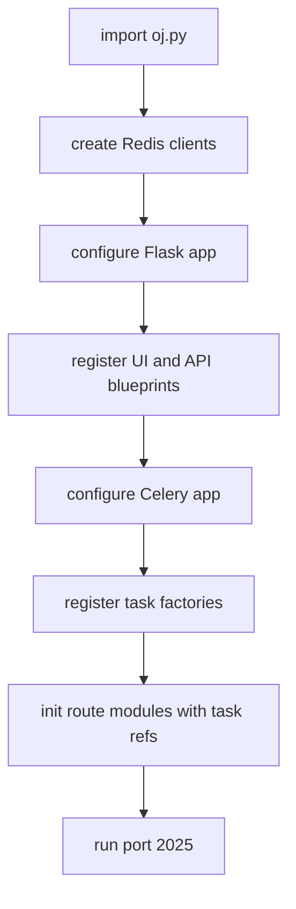
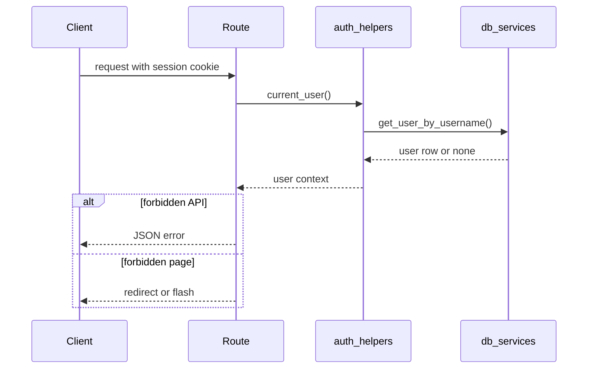

# Web Application and Data Layer

`oj.py` is a thin composition root. It creates Redis clients, builds the Flask app, loads or generates the session secret, configures cookies and upload limits, registers blueprints, configures Celery, registers task factories, and injects task references back into route modules. That last step is load-bearing: route modules should receive task callables through `init_*_module(...)` instead of importing Celery tasks directly. The web process therefore stays responsible for orchestration, not background implementation.

Sources:
- `oj.py#L66-L74` creates decoded and binary Redis clients.
- `oj.py#L76-L100` loads `SECRET_KEY` or persists a generated key under `tmp/secret_key`.
- `oj.py#L103-L117` configures Flask debug, template reload, upload size, and session cookies.
- `oj.py#L124-L141` registers route blueprints and API blueprints.
- `oj.py#L233-L302` registers Celery tasks and passes them into route initializers.

The HTTP layer is split into browser routes and JSON API routes. Browser routes live under `oj_modules/routes`, while API routes live under `oj_modules/api` and are registered through `API_BLUEPRINTS`. The API mirrors major product areas: problems, submissions, admin user/task views, homework, ranking, repository context, forum, and AI detection. API responses use helper functions for consistent success/error payloads and public field filtering.

Sources:
- `oj_modules/api/__init__.py#L4-L22` lists API blueprints.
- `oj_modules/api/helpers.py#L10-L28` defines public field allowlists.
- `oj_modules/api/helpers.py#L31-L71` implements JSON serialization and success/error helpers.
- `oj_modules/api/problem_api.py#L80-L115` exposes `/api/problems` from the same context used by the UI.
- `oj_modules/api/ranking_api.py#L118-L136` exposes `/api/ranking/competitions` with public competition fields.

Authentication and authorization are centralized in `auth_helpers.py`. `current_user()` reads `session["username"]` and fetches a user row. `is_admin()` checks the `is_admin` flag. Decorators return JSON errors for API clients and redirects for browser routes, which lets the same app support both interactive UI and automation-friendly API clients. Password handling moved into `security_utils.py`, which verifies Werkzeug hashes, upgrades legacy SHA-256 hashes after successful login, and supplies Redis-backed rate limit/cooldown helpers that fail open if Redis is unavailable.

Sources:
- `oj_modules/auth_helpers.py#L4-L9` explains the central auth-helper rationale.
- `oj_modules/auth_helpers.py#L18-L29` implements `current_user` and `is_admin`.
- `oj_modules/auth_helpers.py#L31-L64` implements JSON-aware login/admin decorators.
- `oj_modules/security_utils.py#L20-L42` implements hash/verify plus legacy rehash.
- `oj_modules/security_utils.py#L45-L90` implements Redis rate limit and cooldown helpers.

The database layer is intentionally centralized. `db_services.py` owns the PyMySQL connection pool, fork-safety checks, checkout/release behavior, lazy schema compatibility helpers, and dynamic-table validation. Code should call `get_db_connection()` rather than constructing PyMySQL connections directly. Dynamic class tables are a recurring feature of this application, so `safe_table_name(name)` is the required guard before interpolating table names into SQL.

Sources:
- `oj_modules/db_services.py#L47-L62` validates dynamic table names with `safe_table_name`.
- `oj_modules/db_services.py#L102-L112` builds raw PyMySQL connections.
- `oj_modules/db_services.py#L115-L143` defines the pooled connection proxy.
- `oj_modules/db_services.py#L143-L283` implements warmup, fork safety, checkout, release, and recycling.
- `oj_modules/db_services.py#L286-L333` exposes `get_db_connection` and lazy migration helpers.

Markdown is treated as untrusted unless sanitized. Forum posts and written-homework display paths render Markdown and then pass the HTML through `sanitize_html`. The sanitizer has a Bleach allowlist and a regex fallback, which is important because templates use `|safe` for rendered Markdown. Flask also adds broad security headers and a configurable CSP in `oj.py`.

Sources:
- `oj_modules/markdown_utils.py#L4-L13` states the sanitizer purpose.
- `oj_modules/markdown_utils.py#L23-L41` defines allowed tags, attributes, and protocols.
- `oj_modules/markdown_utils.py#L51-L99` implements sanitization and Markdown rendering.
- `oj_modules/routes/submission_routes.py#L54-L86` sanitizes written-homework Markdown display.
- `oj_modules/routes/forum_routes.py#L78-L82` sanitizes forum Markdown.
- `oj.py#L155-L195` adds CSP/security headers and a generic error handler.

