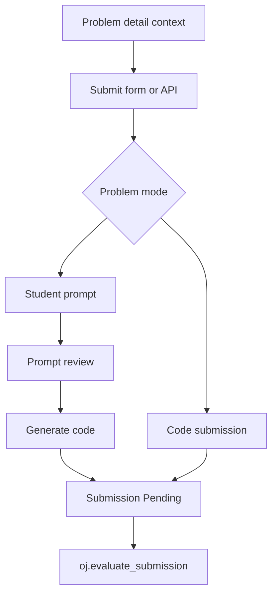
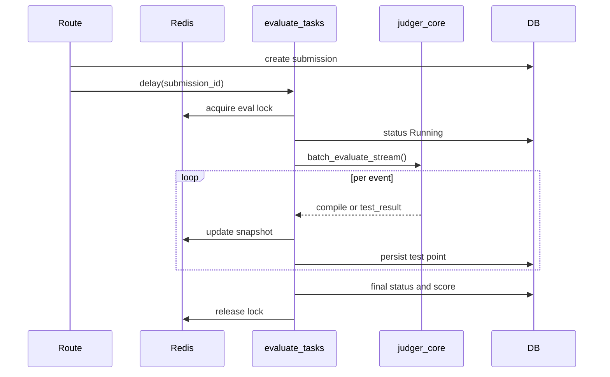

# Judging and Submissions

Programming submissions begin in the problem detail and submit routes. The problem API and UI share context builders so visibility, remaining submission count, initial code, and grading mode stay consistent. A programming problem can use traditional execution, image-based output grading, or Promptly mode. Promptly stores the student's prompt as the submitted content, checks whether the prompt is detailed enough, generates code with the configured model, and only then hands the generated code to the ordinary evaluation task.

Sources:
- `oj_modules/routes/problem_core_routes.py#L670-L695` serves the problem list and detail pages.
- `oj_modules/routes/problem_core_routes.py#L996-L1097` accepts code or Promptly submissions, archives them, increments counts, and enqueues work.
- `oj_modules/api/problem_api.py#L118-L164` exposes submit context and declares whether the input is code, prompt, PDF, or ZIP.
- `oj_modules/tasks/promptly_tasks.py#L1-L7` states that Promptly generates code before normal evaluation.
- `oj_modules/tasks/promptly_tasks.py#L48-L88` reviews the prompt, generates code, stores it, and queues evaluation.

The evaluation task is idempotency-aware. It uses Redis locks keyed by submission id, sets the submission status to `Running`, writes snapshot state for the live UI, loads problem language/test data/forbidden functions/user header files, wraps code according to language and problem scaffolding, and dispatches the execution to `judger_core`. It prefers streaming batch evaluation so each test point can update the snapshot as soon as it completes; fallback paths handle non-stream batch and individual per-test execution.

Sources:
- `oj_modules/tasks/evaluate_tasks.py#L150-L227` implements Redis submission locks and lock cleanup.
- `oj_modules/tasks/evaluate_tasks.py#L303-L337` starts the task, marks `Running`, and writes a snapshot.
- `oj_modules/tasks/evaluate_tasks.py#L339-L386` loads code, problem metadata, user files, and forbidden functions.
- `oj_modules/tasks/evaluate_tasks.py#L387-L479` wraps language-specific code and parses time limits/test data.
- `oj_modules/tasks/evaluate_tasks.py#L629-L759` streams batch events into per-test snapshots.
- `oj_modules/tasks/evaluate_tasks.py#L970-L978` writes the final score and status.

The sandbox boundary is no longer a separate HTTP service. `judger_core.py` exposes library functions used directly by the Celery worker: `run_single`, `batch_evaluate_stream`, and `batch_evaluate`. Each run lives under `JUDGER_RUN_ROOT`, uses safe user-header filenames, writes per-submission files, and cleans old run directories. For C/C++, the core compiles once for streaming batch runs and then reuses a persistent container session per test case. For interpreted languages, it also uses persistent sessions where possible, including Octave warmup.

Sources:
- `oj_modules/judger_core.py#L3-L12` documents the in-process Docker sandbox API.
- `oj_modules/judger_core.py#L23-L43` defines root and run-directory locations.
- `oj_modules/judger_core.py#L357-L375` checks forbidden functions.
- `oj_modules/judger_core.py#L393-L415` validates and writes user repository files.
- `oj_modules/judger_core.py#L763-L878` implements compiled streaming batch evaluation.
- `oj_modules/judger_core.py#L880-L996` implements interpreted streaming batch evaluation.
- `oj_modules/judger_core.py#L999-L1040` dispatches `run_single`, streaming batch, and non-stream batch.

Docker sandboxing is centralized in `docker_sandbox.py`. Container runs use network isolation, no-new-privileges, memory and CPU limits, PIDs limits, read-only root, tmpfs, user `runner`, and environment variables to restrict BLAS/OMP thread counts. A persistent `ContainerSession` provides the same isolation model for multi-test batches while avoiding repeated container startup costs. `judger_core` also selects MKL or OpenBLAS compile/link flags depending on the image and architecture.

Sources:
- `oj_modules/docker_sandbox.py#L48-L69` reads image, memory, CPU, PIDs, network, and timeout config.
- `oj_modules/docker_sandbox.py#L71-L97` builds thread and graphics/font-cache environment settings.
- `oj_modules/docker_sandbox.py#L124-L185` constructs isolated `docker run` arguments.
- `oj_modules/docker_sandbox.py#L188-L287` implements the persistent container session.
- `oj_modules/judger_core.py#L199-L245` selects numeric backend and compiler/linker flags.

Submission status is exposed through `submission_routes.py`, which enforces owner/admin checks before showing source, generated code, written-homework content, or JSON status. This keeps live polling and detail views tied to the same authorization model as the submit flow.

Sources:
- `oj_modules/routes/submission_routes.py#L150-L175` lists submissions.
- `oj_modules/routes/submission_routes.py#L178-L228` renders submission details with owner/admin access checks.
- `oj_modules/routes/submission_routes.py#L231-L260` returns status JSON with access checks.

