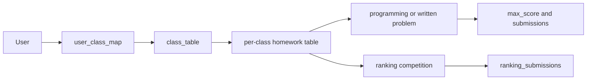
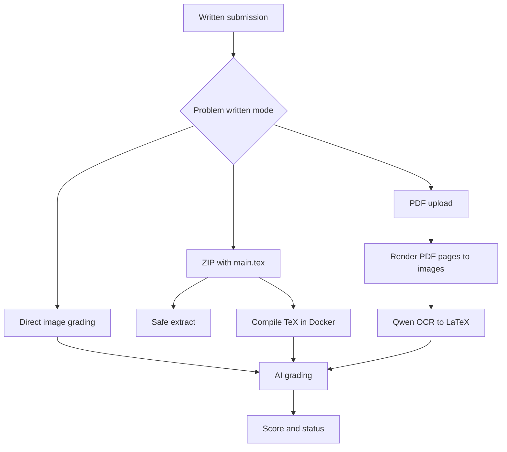

# Written Homework and Coursework

Coursework is built from classes, class membership, class homework tables, ordinary programming/written problems, and ranking competitions assigned as homework. Class membership is stored in `user_class_map` with a fallback to the legacy `users.class` field. Students can join or leave classes when the class-adjust setting is enabled, while admins can add or remove users and import final exam scores from spreadsheets.

Sources:
- `oj_modules/routes/class_management_routes.py#L47-L123` imports final exam scores from `.xlsx` or `.xls`.
- `oj_modules/routes/class_management_routes.py#L126-L170` lets admins add users to classes.
- `oj_modules/routes/class_management_routes.py#L173-L210` removes users while protecting the primary class relation.
- `oj_modules/routes/class_management_routes.py#L213-L237` exposes the current user's class list.
- `oj_modules/routes/class_management_routes.py#L240-L360` implements join and leave flows.

Admins manage homework from `homework_routes.py`. The route can list homework for a class, add either a problem or a ranking competition as the homework item, update deadlines, delete entries, and export scores. Dynamic class tables are always wrapped by `safe_table_name`. The score export merges problem scores from `max_score` with ranking scores from `ranking_submissions`, encodes CSV output as GBK for Chinese spreadsheet compatibility, and appends a total column.

Sources:
- `oj_modules/routes/homework_routes.py#L57-L84` loads class homework and validates ordinary problems.
- `oj_modules/routes/homework_routes.py#L98-L122` loads students from `user_class_map` with legacy fallback.
- `oj_modules/routes/homework_routes.py#L157-L191` finds best submissions per student/problem.
- `oj_modules/routes/homework_routes.py#L404-L478` adds a problem or ranking competition homework item.
- `oj_modules/routes/homework_routes.py#L522-L695` exports class scores from problem and ranking sources.

Written homework is processed by a dedicated Celery task. The task supports multiple input modes: direct image-aware grading, ZIP archives containing TeX projects, and PDF OCR followed by AI grading. It uses an idempotency lock, marks the submission `Running`, detects deterministic input errors separately from retryable errors, and writes final score/status back to the database. TeX compilation happens inside the Docker sandbox and includes safety checks for ZIP extraction and required `main.tex`.

Sources:
- `oj_modules/tasks/written_homework_tasks.py#L32-L41` defines task names and time limits.
- `oj_modules/tasks/written_homework_tasks.py#L91-L177` compiles TeX in the Docker sandbox.
- `oj_modules/tasks/written_homework_tasks.py#L245-L280` safely extracts ZIP submissions.
- `oj_modules/tasks/written_homework_tasks.py#L321-L347` acquires the idempotency lock and sets `Running`.
- `oj_modules/tasks/written_homework_tasks.py#L368-L374` handles direct image grading.
- `oj_modules/tasks/written_homework_tasks.py#L375-L489` handles ZIP/TeX mode.
- `oj_modules/tasks/written_homework_tasks.py#L490-L558` handles PDF OCR, grading, finalization, and errors.

The AI utility layer contains the OCR, image conversion, model calls, and result parsing used by written homework. PDFs are rendered to images, unsafe formats are converted, image batches are sent to Qwen Omni/VL-style models, and the grading result is parsed into score and feedback. The same module also supports image-based programming-output grading, which is why written homework and programming image grading share model configuration patterns.

Sources:
- `oj_modules/ai_utils.py#L67-L93` defines written and programming image grading model specs.
- `oj_modules/ai_utils.py#L568-L593` renders PDFs to images.
- `oj_modules/ai_utils.py#L601-L623` prepares image data URLs and converts unsafe formats.
- `oj_modules/ai_utils.py#L626-L714` splits and transcribes image batches.
- `oj_modules/ai_utils.py#L717-L782` transcribes images to LaTeX.
- `oj_modules/ai_utils.py#L873-L928` parses written-homework grading JSON and feedback.

Manual grading and teacher review are narrow but important. `grading_routes.py` protects download access so only the submitter or an admin can download submitted files. Admins can manually set a score and move to the next pending written submission. There is also a route to invalidate pending written submissions for a problem when a grading setup changes.

Sources:
- `oj_modules/routes/grading_routes.py#L69-L96` protects written-submission file downloads.
- `oj_modules/routes/grading_routes.py#L99-L121` implements admin manual grading.
- `oj_modules/routes/grading_routes.py#L124-L172` finds the next pending written submission.
- `oj_modules/routes/grading_routes.py#L175-L184` invalidates pending submissions for a problem.

Homework export also includes plagiarism support. Code is normalized by removing comments and collapsing whitespace, then `SequenceMatcher` compares submissions per problem. Repository includes can be expanded into the plagiarism corpus so copied helper headers can be considered alongside the direct submitted code.

Sources:
- `oj_modules/routes/homework_routes.py#L205-L221` expands repository include files for plagiarism inputs.
- `oj_modules/routes/homework_routes.py#L697-L742` normalizes code and computes pairwise similarity.

