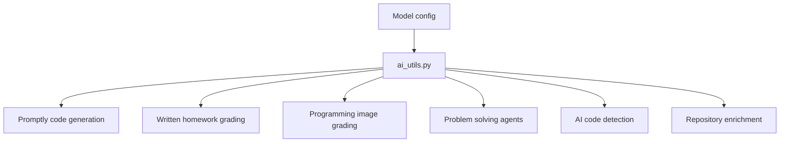
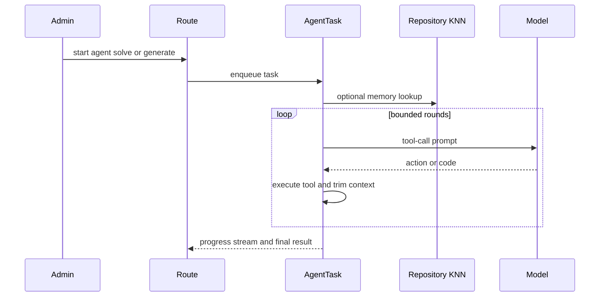

# AI and Repository Intelligence

AI functionality is concentrated in `ai_utils.py` and task modules. The utility layer resolves model credentials, supports DashScope/OpenAI-compatible text calls with streaming fallback behavior, handles image+text chat, and normalizes written-homework or programming-image grading responses. This keeps route modules and Celery tasks from duplicating provider-specific details. The same model configuration style feeds tutor feedback, Promptly, written homework, agent solving, repository enrichment, and AI-code detection.

Sources:
- `oj_modules/ai_utils.py#L148-L177` validates credentials and resolves endpoints.
- `oj_modules/ai_utils.py#L215-L295` calls text models through the OpenAI SDK and requests fallback.
- `oj_modules/ai_utils.py#L785-L870` calls image+text chat models.
- `oj_modules/ai_utils.py#L972-L1053` supports programming image grading and written-homework grading entry points.
- `config.py#L39-L58` defines DashScope and Qwen model settings.

The admin-facing problem-solving agent is a multi-round ReAct-style loop. It verifies that the problem is programming-only and the user is an admin, initializes a workspace, optionally injects repository KNN memory, enforces `AGENT_MAX_ROUNDS`, trims context, logs API requests, and uses Qwen coder tool calls to iterate. The test-data generation agent follows the same broad pattern but requires a standard solution and produces additional test cases under stricter prompts and submit limits.

Sources:
- `oj_modules/tasks/agent_solve_task.py#L24-L63` initializes agent state and validates admin/programming access.
- `oj_modules/tasks/agent_solve_task.py#L92-L145` creates the workspace and injects repository KNN memory.
- `oj_modules/tasks/agent_solve_task.py#L160-L213` enforces max rounds and trims context.
- `oj_modules/tasks/agent_solve_task.py#L215-L257` performs Qwen coder tool calls.
- `oj_modules/tasks/agent_generate_testdata_task.py#L19-L60` clamps test-point counts and validates admin/problem state.
- `oj_modules/tasks/agent_generate_testdata_task.py#L110-L181` runs strict prompt, max-round, trim, and model-request logic.

The personal code repository lets users store C/C++ header and source files, then use them through `#include` during judging. Routes validate filenames, extensions, and size before saving or uploading files. When a student submits code, repository include expansion can load referenced files; when indexing is requested, a Celery task delegates to `repository_index_services.py`.

Sources:
- `oj_modules/routes/repository_routes.py#L49-L84` lists repository files.
- `oj_modules/routes/repository_routes.py#L114-L170` validates and saves files.
- `oj_modules/routes/repository_routes.py#L197-L243` validates uploads.
- `oj_modules/routes/repository_routes.py#L245-L340` starts full or per-file index jobs.
- `oj_modules/repository_services.py#L9-L44` extracts includes and loads user repository files.
- `oj_modules/tasks/repository_index_tasks.py#L7-L18` wraps repository indexing as a Celery task.

Repository indexing is more than raw embedding. It creates/migrates index job tables, parses code with tree-sitter and recovery logic, enriches function/class chunks through Qwen structured summaries, embeds combined text containing names, signatures, summaries, params, returns, class context, and code, normalizes vectors, stores chunk rows and binary embeddings in MySQL, and writes FAISS indexes atomically with metadata consistency checks.

Sources:
- `oj_modules/repository_index_services.py#L85-L133` creates and migrates index job tables.
- `oj_modules/repository_index_services.py#L972-L1302` extracts classes/functions with tree-sitter and recovery logic.
- `oj_modules/repository_index_services.py#L1354-L1419` enriches chunks with Qwen structured metadata.
- `oj_modules/repository_index_services.py#L1765-L1834` validates embedding provider config and calls DashScope embeddings.
- `oj_modules/repository_index_services.py#L1876-L1897` builds embedding input text.
- `oj_modules/repository_index_services.py#L1900-L1997` manages FAISS files and resets storage.
- `oj_modules/repository_index_services.py#L2145-L2235` inserts classes, chunks, and embeddings.
- `oj_modules/repository_index_services.py#L2271-L2520` runs full/file index jobs.
- `oj_modules/repository_index_services.py#L2700-L2826` searches FAISS-backed repository chunks.

AI-code detection combines an LLM score and behavior score. The final score is capped with `min(1.0, llm_score + behavior_score * 0.3)`, then classified into high, medium, or low risk. Celery tasks can run single detections or batches filtered by problem or user, skip non-MATLAB or non-programming submissions, and update Redis progress trackers plus database result rows.

Sources:
- `oj_modules/ai_detection/detector.py#L15-L29` defines score fusion and risk thresholds.
- `oj_modules/ai_detection/detector.py#L32-L108` builds the result structure, runs LLM/behavior detectors, and fuses scores.
- `oj_modules/tasks/ai_detection_tasks.py#L27-L81` defines task names and batch progress behavior.
- `oj_modules/tasks/ai_detection_tasks.py#L84-L165` runs single and batch detection, including skip rules.

