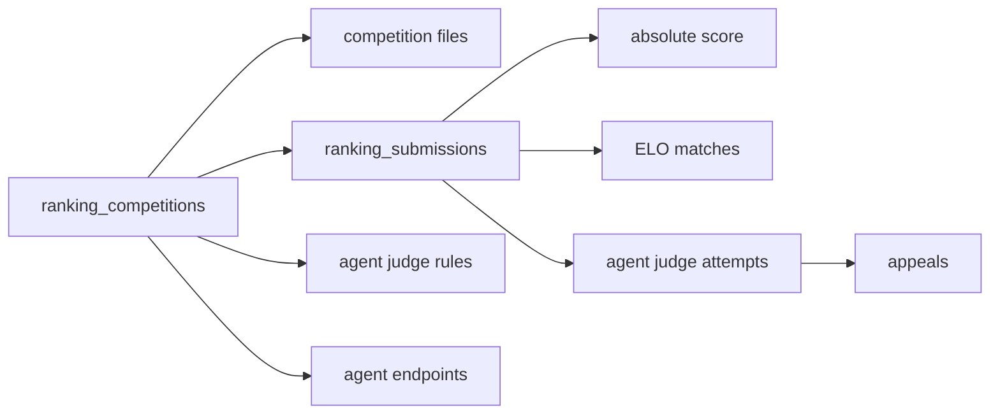
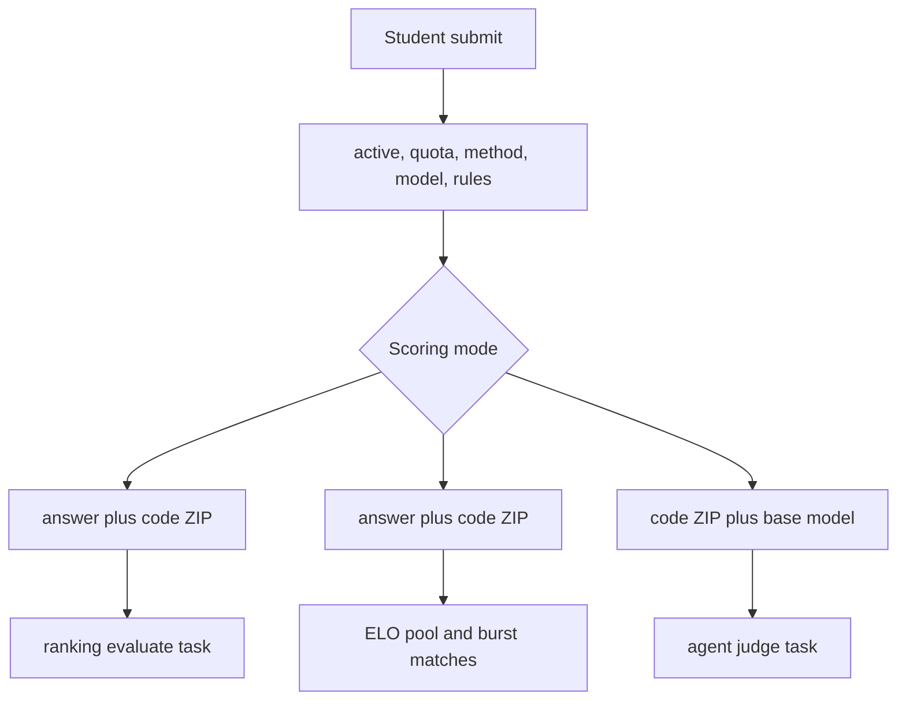

# Ranking Competitions

Ranking competitions are a separate product surface from ordinary homework problems. They use `ranking_db.py` for schema creation, migrations, file locations, submission quotas, competition CRUD, leaderboard queries, ELO state, appeals, Agent-as-Judge configuration, and file metadata. The data model supports answer files, code ZIPs, competition attachments, reference data, scoring scripts, submission windows, Git submission mode, and 48-hour submission quotas.

Sources:
- `oj_modules/ranking_db.py#L3-L10` describes the ranking DB layer.
- `oj_modules/ranking_db.py#L24-L55` defines upload subdirectories and the quota-window helper.
- `oj_modules/ranking_db.py#L58-L86` creates the `ranking_competitions` table.
- `oj_modules/ranking_db.py#L99-L180` migrates ELO, Agent-as-Judge, endpoint, mode, and submit-limit columns.
- `oj_modules/ranking_db.py#L181-L230` creates submission-method and file/submission tables.
- `oj_modules/ranking_db.py#L292-L336` creates ELO match and appeal tables.

The ranking route supports tabs for description, submit, leaderboard, matches, all submissions, appeals, edit, and batch evaluation. Submission guards check active status, scoring mode, submission method, model endpoint readiness, judge rules, rate limits, and per-window quota. Ordinary absolute/ELO modes require both answer file and code ZIP. Agent-as-Judge mode only requires a code ZIP, but it also requires model and rule configuration. Git submission mode has separate repository check and submit routes.

Sources:
- `oj_modules/routes/ranking_routes.py#L104-L128` declares tabs, size limits, and supported scoring/answer modes.
- `oj_modules/routes/ranking_routes.py#L162-L226` computes endpoint readiness and submit block reasons.
- `oj_modules/routes/ranking_routes.py#L557-L718` builds the competition detail view and tab context.
- `oj_modules/routes/ranking_routes.py#L1120-L1287` implements ZIP/answer submission for absolute, ELO, and Agent-as-Judge modes.
- `oj_modules/routes/ranking_routes.py#L1319-L1360` implements Git repository check and Git submit entry points.

Absolute scoring is deterministic around a scoring script contract. The task validates the submission and competition, locates the uploaded answer, reference, and scoring script, executes `python script user_answer reference max_score`, expects JSON on stdout, clamps the score, and writes Accepted or Error. ELO scoring is match-based: a periodic scheduler chooses pairs, a scoring script returns a winner, and the task updates ratings under lock using the expected-score formula.

Sources:
- `oj_modules/tasks/ranking_evaluate_tasks.py#L3-L8` describes standard answer scoring.
- `oj_modules/tasks/ranking_evaluate_tasks.py#L35-L85` defines the scoring script contract and JSON stdout.
- `oj_modules/tasks/ranking_evaluate_tasks.py#L88-L155` validates inputs, clamps score, and writes status.
- `oj_modules/tasks/ranking_elo_tasks.py#L3-L23` describes scheduler, script contract, locks, and immediate burst.
- `oj_modules/tasks/ranking_elo_tasks.py#L88-L106` implements expected/new ELO ratings.
- `oj_modules/tasks/ranking_elo_tasks.py#L148-L192` defines the ELO scoring script contract.
- `oj_modules/tasks/ranking_elo_tasks.py#L235-L360` runs matches and schedules initial burst.

Agent-as-Judge evaluates submissions inside a prebuilt Docker image containing agent CLIs and toolchains. Pure logic in `ranking_agent_judge.py` normalizes orchestration modes, validates DAG rules, computes topological order and effective results, parses JSONL result lines, renders safe Markdown/Math HTML, and builds prompts. The Celery task prepares a workspace with description, attachments, rules, and result files; selects an endpoint with Redis slot limiting; runs `docker run`; invokes Claude, Codex, or opencode through `run_harness`; ingests results; publishes progress snapshots; and finalizes effective scores.

Sources:
- `oj_modules/ranking_agent_judge.py#L20-L112` normalizes orchestration and validates/topologically sorts rule DAGs.
- `oj_modules/ranking_agent_judge.py#L115-L181` computes effective results, parses result JSONL, and builds `rules.json`.
- `oj_modules/ranking_agent_judge.py#L217-L340` renders safe HTML and builds prompts for single/topological modes.
- `oj_modules/tasks/ranking_agent_judge_tasks.py#L49-L67` reads config with environment precedence.
- `oj_modules/tasks/ranking_agent_judge_tasks.py#L276-L320` selects endpoints and applies Redis slot limiting.
- `oj_modules/tasks/ranking_agent_judge_tasks.py#L700-L779` prepares workspace and Docker run arguments.
- `oj_modules/tasks/ranking_agent_judge_tasks.py#L804-L872` executes harness phases and ingests result files.
- `oj_modules/tasks/ranking_agent_judge_tasks.py#L923-L1152` implements single-container and topological execution.
- `oj_modules/tasks/ranking_agent_judge_tasks.py#L1155-L1360` finalizes scores and registers the task.

The Docker image is a large runtime bundle. It includes toolchains, numerical libraries, Octave/TeX/OCR/browser stacks, Python scientific packages, and agent CLIs. The `run_harness` script selects the requested harness by environment and writes the needed configuration for Codex, opencode, or Claude Code. Production deployment must rebuild this image after changing `docker/agent_judge/*`.

Sources:
- `docker/agent_judge/Dockerfile#L1-L4` documents the build command and base image.
- `docker/agent_judge/Dockerfile#L19-L31` installs toolchains, numerical libraries, Octave, and TeX.
- `docker/agent_judge/Dockerfile#L37-L90` installs OCR/ML/browser/Python packages.
- `docker/agent_judge/Dockerfile#L92-L104` installs agent CLIs and copies harness scripts.
- `docker/agent_judge/run_harness#L117-L251` configures and dispatches Codex, opencode, or Claude harnesses.

