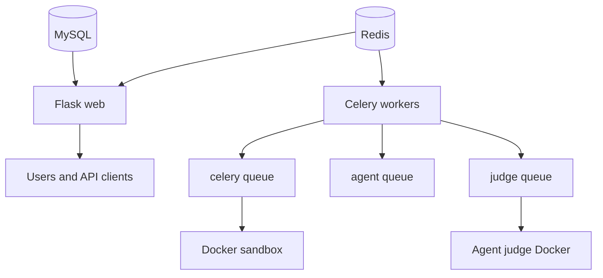
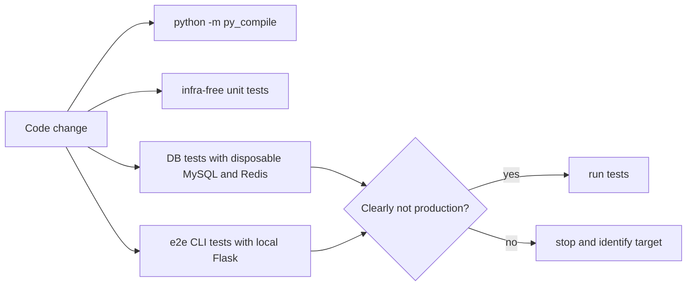

# Operations Testing and Tooling

Local startup requires Redis, MySQL, the Flask web process, and the Celery worker group. The README describes database bootstrap, dependency installation, config editing, optional lightweight Agent-as-Judge image build, and supervisord startup. The web process listens on port 2025. Celery queue separation is part of the runtime contract: `celery` handles ordinary judging, `agent` handles AI agents at low concurrency, and `judge` handles Agent-as-Judge Docker jobs.

Sources:
- `README.md#L40-L67` lists processes and environment requirements.
- `README.md#L69-L148` documents database initialization, config, Docker lite image, supervisord startup, and localhost access.
- `celery.conf#L6-L35` defines the three worker programs and queues.
- `web.conf#L6-L13` defines the web process.
- `oj.py#L218-L232` configures Celery routing and late-ack behavior.

Production deployment is intentionally manual and conservative. Local code is synced to `why-server:/home/ebola/oj/` with an rsync command that excludes sensitive or production-only paths. Python/config changes require restarting the two app supervisord groups, while frontend-only template/client-asset changes can be copied without a restart because templates hot-reload. Production `config.py` and `static/` must not be overwritten. Agent-as-Judge image changes require a Docker rebuild on the server.

Sources:
- Project instructions in `AGENTS.md` under "Deployment to why-server" define rsync, supervisord restart order, and frontend-only fast path.
- Project instructions under "Remote files that must NOT be overwritten" identify production `static/` and `config.py`.
- Project instructions under "Agent-as-Judge image" define Docker image rebuild behavior.
- `README.md#L131-L148` describes the local supervisord process start.

Testing is split by risk. The repository has unit tests, DB tests, e2e tests, and CI infra. Unit tests include infra-free judger/security/grading/sandbox checks. DB tests and e2e tests need disposable MySQL/Redis. CI container scripts are explicit about not using production config, skipping live AI, and running selected modules. The project has a strong safety boundary: tests must not be run on the production host or against production MySQL/Redis because fixtures truncate and recreate tables.

Sources:
- `pytest.ini#L1-L11` defines test paths, timeout, and markers.
- `tests/conftest.py#L32-L42` lists core tables reset by fixtures.
- `tests/conftest.py#L83-L121` imports schema and ensures compatibility columns.
- `tests/conftest.py#L134-L184` flushes Redis, truncates/drops tables, and seeds classes/admin.
- `tests/conftest.py#L189-L230` marks unit tests as infra-free and skips DB reset for them.
- `tests/conftest.py#L247-L293` mocks AI, SMTP, and embeddings.
- `tests/ci/README.md#L1-L6` describes isolated CI infrastructure and the production-host ban.
- `tests/ci/run-ci.sh#L1-L36` runs in `/app`, avoids production config, skips live AI, and emits JUnit XML.

The repository also ships Codex/Claude-style CLI skills for end-to-end app interaction. `numoj-admin` and `numoj-user` drive real HTTP routes and JSON APIs instead of importing source code or touching the database directly. This makes them suitable for e2e workflows and manual smoke checks when a local disposable service is running. The JSON API layer exists partly to make those skills stable: problem, ranking, repository, forum, homework, submission, and AI-detection endpoints return structured payloads with public-field filtering.

Sources:
- `skills/numoj-admin/SKILL.md#L8-L9` says the admin CLI uses HTTP/JSON APIs only.
- `skills/numoj-admin/SKILL.md#L34-L64` defines the admin workflow and command areas.
- `skills/numoj-user/SKILL.md#L8-L9` says the user CLI uses HTTP/JSON APIs only.
- `skills/numoj-user/SKILL.md#L34-L58` defines the user workflow and command areas.
- `oj_modules/api/__init__.py#L4-L22` registers API blueprints.

Operationally, the most important boundary is data safety. Anything that can reset tables, import SQL, migrate production data, repair records, or run e2e test flows must prove it is targeting local or disposable infrastructure first. Read-only production inspection is acceptable, but writes require explicit user approval and a rollback plan. The app itself reflects that posture by centralizing config, keeping production secrets out of sync, and preferring environment/default-based hardening knobs for newer runtime settings.

Sources:
- Project instructions under "Data safety boundary" define the production-host ban and data-write approval rules.
- `config.py#L5-L24` loads optional `.env` values while keeping `config.py` as the main template.
- `config.py#L104-L128` keeps newer Agent-as-Judge and judger knobs configurable with defaults.

