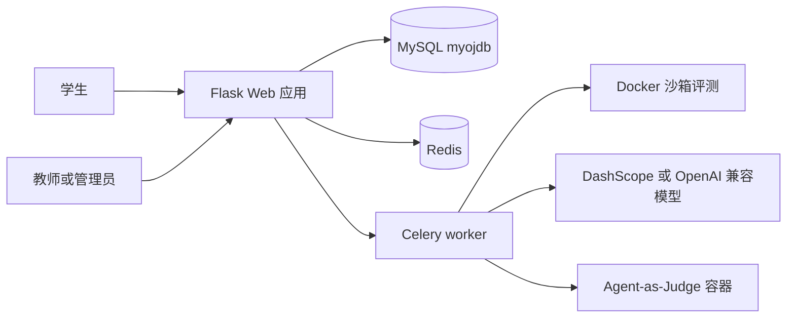
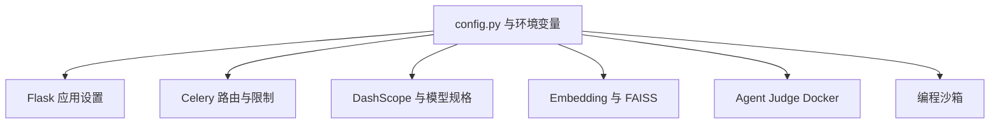

# 项目概览

NumericalOJ 是面向程序设计与数学类课程的在线评测系统。它的中心是一个 Flask Web 应用，负责中文界面与 JSON API；耗时或高风险工作交给 Celery worker，包括编程题评测、AI Agent、书面作业批改、个人代码库索引、AI 代码检测和打榜赛评测。它不是单纯的 ACM 风格 OJ，而是把班级作业、学生成绩、MATLAB/Octave 题、C/C++/Python 评测、书面作业 OCR、个人头文件仓库、论坛以及多种 AI 工作流放在同一个教学平台中。

来源:
- `README.md#L3-L17` 描述项目定位、支持语言、AI 功能和生产使用场景。
- `README.md#L19-L38` 列出班级管理、AI 代码检测、标准评测、Agent、书面作业、代码库搜索、打榜赛、论坛和小游戏。
- `oj.py#L124-L141` 注册了这些功能对应的蓝图。

部署模型保持得很小：一个 Web 进程，一个包含多队列 worker 的 Celery supervisor 组，外加 Redis 和 MySQL。Web 进程处理页面和 API 请求，同时注册任务工厂；Celery 按队列隔离普通评测、低并发 AI Agent、以及可能运行 Docker 和消耗付费模型额度的 Agent-as-Judge 任务。这个隔离很关键，因为编程题需要较高并发，AI Agent 需要长超时和低并发，打榜赛 Agent 还需要额外的容器运行时约束。

来源:
- `README.md#L40-L48` 说明两个应用进程以及 Redis/MySQL 依赖。
- `celery.conf#L6-L35` 定义 `celery_judge`、`celery_agent`、`celery_agent_judge` 三类 worker。
- `web.conf#L6-L13` 用 `python3 oj.py` 启动 Flask Web 进程。

| 功能面 | 主要用户 | 主要模块 | 说明 |
| --- | --- | --- | --- |
| 编程题 | 学生、管理员 | `problem_core_routes`, `evaluate_tasks`, `judger_core` | MATLAB/Octave、C、C++、Python |
| 书面作业 | 学生、管理员 | `written_homework_tasks`, `ai_utils`, `grading_routes` | PDF OCR、图片直接评分、TeX ZIP 批改 |
| 个人代码库 | 学生 | `repository_routes`, `repository_index_services` | 头文件、代码块元数据、embedding、FAISS |
| AI Agent | 管理员 | `agent_solve_task`, `agent_generate_testdata_task` | 解题与生成测试数据 |
| AI 代码检测 | 管理员 | `ai_detection_tasks`, `ai_detection/detector.py` | 面向 MATLAB 的 LLM 分和行为分融合 |
| 打榜赛 | 学生、管理员 | `ranking_db`, `ranking_routes`, ranking tasks | 绝对分、ELO、Agent-as-Judge |
| JSON API | skills 与 UI 客户端 | `oj_modules/api/*` | 基于会话的结构化 API |

配置集中在跟踪版本的 `config.py` 模板中。它定义 MySQL/Redis、DashScope/Qwen 模型、代码库 embedding、AI Agent 限制、ModelScope 搜索、Agent-as-Judge Docker、以及评测沙箱的默认参数。较新的加固项通常通过环境变量或 `getattr` 默认值读取，这样生产环境可以保留本地敏感配置，而不用在部署同步时覆盖。

来源:
- `config.py#L31-L37` 定义 MySQL 连接池配置。
- `config.py#L39-L58` 定义 DashScope、Qwen 和 MIMO 模型配置。
- `config.py#L60-L78` 定义 Redis 快照/锁 TTL 和代码库 embedding 配置。
- `config.py#L83-L116` 定义 Agent、Web 搜索和 Agent-as-Judge 参数。
- `config.py#L118-L128` 定义 Docker 沙箱默认值。

仓库结构也围绕这个运行边界组织。`oj.py` 是组合壳，`oj_modules/routes` 放浏览器页面路由，`oj_modules/api` 放 JSON API，`oj_modules/tasks` 放 Celery 任务工厂，专门的 service 模块负责数据库、代码库索引、打榜赛数据、AI 工具和沙箱执行。模板目录是扁平结构且以中文展示为主，静态资源本地 vendored。测试按基础设施需求拆分为无服务单元测试、需要 MySQL/Redis 的 DB 测试和 e2e 测试。

来源:
- `README.md#L161-L170` 给出顶层目录结构。
- `oj.py#L14-L57` 导入 DB service、路由、API 和任务工厂。
- `pytest.ini#L1-L11` 定义 unit、db、e2e、ci 测试路径和 marker。

