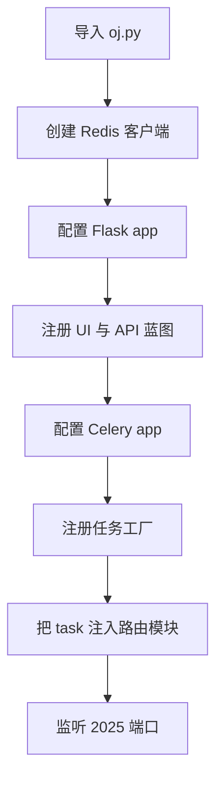
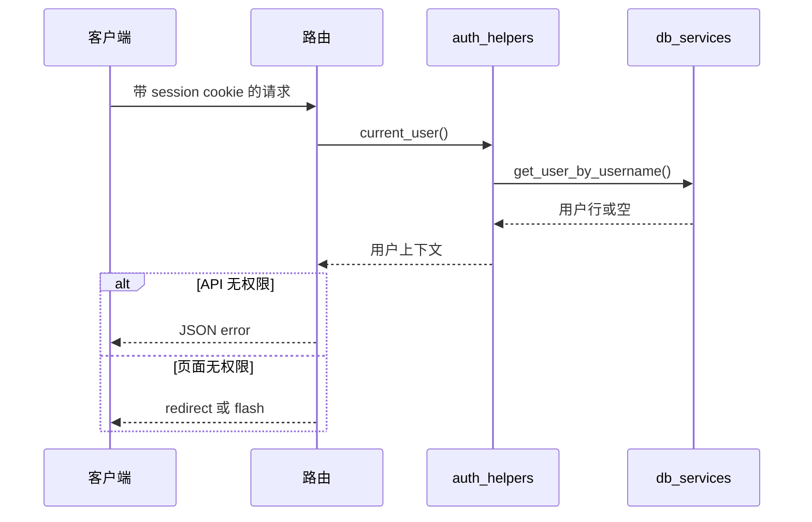

# Web应用与数据层

`oj.py` 是很薄的组合根。它创建 Redis 客户端，构造 Flask app，加载或生成 session secret，配置 cookie 与上传大小，注册蓝图，配置 Celery，注册任务工厂，并把任务引用注入回需要它们的路由模块。最后一步是架构约束：路由模块通过 `init_*_module(...)` 接收 task callable，而不是直接 import Celery task。这样 Web 进程负责装配与编排，后台实现留在任务模块中。

来源:
- `oj.py#L66-L74` 创建 decoded 和 binary 两个 Redis 客户端。
- `oj.py#L76-L100` 加载 `SECRET_KEY`，或在 `tmp/secret_key` 持久化生成值。
- `oj.py#L103-L117` 配置 Flask debug、模板热加载、上传大小和 session cookie。
- `oj.py#L124-L141` 注册 UI 蓝图和 API 蓝图。
- `oj.py#L233-L302` 注册 Celery task，并把引用传入路由初始化函数。

HTTP 层分成浏览器路由和 JSON API 路由。浏览器路由在 `oj_modules/routes` 下，API 路由在 `oj_modules/api` 下，并通过 `API_BLUEPRINTS` 统一注册。API 覆盖题目、提交、管理员用户/任务、作业、打榜赛、代码库上下文、论坛和 AI 检测。响应使用 helper 统一 success/error 结构、序列化和公开字段过滤。

来源:
- `oj_modules/api/__init__.py#L4-L22` 列出 API 蓝图。
- `oj_modules/api/helpers.py#L10-L28` 定义公开字段 allowlist。
- `oj_modules/api/helpers.py#L31-L71` 实现 JSON 序列化与 success/error helper。
- `oj_modules/api/problem_api.py#L80-L115` 从 UI 共用上下文暴露 `/api/problems`。
- `oj_modules/api/ranking_api.py#L118-L136` 用公开字段暴露 `/api/ranking/competitions`。

认证与授权集中在 `auth_helpers.py`。`current_user()` 读取 `session["username"]` 并查询用户行，`is_admin()` 检查管理员标记。装饰器能根据请求类型对 API 返回 JSON 错误，对页面路由返回重定向，因此同一套应用既能支撑交互页面，也能支撑自动化 API 客户端。密码逻辑放在 `security_utils.py`：它验证 Werkzeug hash，在旧 SHA-256 密码登录成功后升级 hash，并提供 Redis 固定窗口限流和冷却时间工具；Redis 异常时按 fail-open 处理。

来源:
- `oj_modules/auth_helpers.py#L4-L9` 解释集中认证 helper 的动机。
- `oj_modules/auth_helpers.py#L18-L29` 实现 `current_user` 和 `is_admin`。
- `oj_modules/auth_helpers.py#L31-L64` 实现兼容 JSON 的 login/admin 装饰器。
- `oj_modules/security_utils.py#L20-L42` 实现 hash/verify 与旧 hash 升级。
- `oj_modules/security_utils.py#L45-L90` 实现 Redis 限流和冷却时间。

数据库层也被强制集中。`db_services.py` 管理 PyMySQL 连接池、fork safety、checkout/release、连接回收、懒加载兼容迁移和动态表名校验。业务代码应调用 `get_db_connection()`，不要直接构造 PyMySQL 连接。动态班级表是这个项目的常见模式，所以任何把表名插入 SQL 的地方都必须先用 `safe_table_name(name)`。

来源:
- `oj_modules/db_services.py#L47-L62` 用 `safe_table_name` 校验动态表名。
- `oj_modules/db_services.py#L102-L112` 构造底层 PyMySQL 连接。
- `oj_modules/db_services.py#L115-L143` 定义池化连接代理。
- `oj_modules/db_services.py#L143-L283` 实现 warmup、fork safety、checkout、release 和 recycle。
- `oj_modules/db_services.py#L286-L333` 暴露 `get_db_connection` 和懒迁移 helper。

Markdown 一律按不可信输入处理，除非已经消毒。论坛和书面作业展示会先 render Markdown，再经过 `sanitize_html`；模板中使用 `|safe` 的 Markdown 汇入点必须走这个路径。消毒器以 Bleach allowlist 为主，附带正则 fallback。`oj.py` 还在响应层加了安全 header 和可配置 CSP。

来源:
- `oj_modules/markdown_utils.py#L4-L13` 说明 sanitizer 的职责。
- `oj_modules/markdown_utils.py#L23-L41` 定义允许的标签、属性和协议。
- `oj_modules/markdown_utils.py#L51-L99` 实现消毒和 Markdown 渲染。
- `oj_modules/routes/submission_routes.py#L54-L86` 对书面作业 Markdown 展示消毒。
- `oj_modules/routes/forum_routes.py#L78-L82` 对论坛 Markdown 消毒。
- `oj.py#L155-L195` 添加 CSP、安全 header 和通用错误处理。

