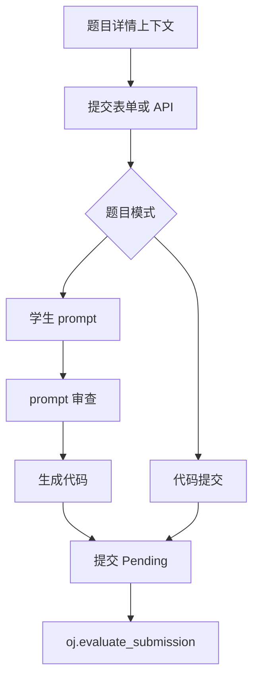
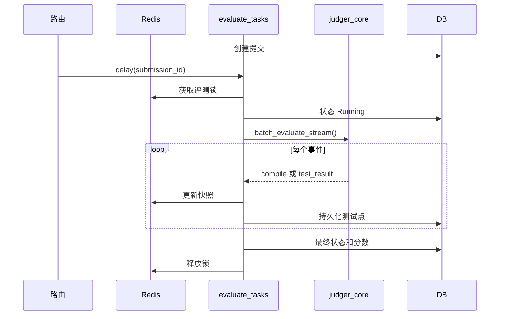

# 评测与提交流水线

编程题提交从题目详情和提交路由进入。题目 API 与页面共用上下文构造函数，因此可见性、剩余提交次数、初始代码和批改模式在页面与 API 中保持一致。编程题可以是传统执行、图片输出 AI 批改，或 Promptly 模式。Promptly 会把学生 prompt 作为提交内容保存，先检查 prompt 是否足够具体，再用配置模型生成代码，最后把生成代码交给普通评测 task。

来源:
- `oj_modules/routes/problem_core_routes.py#L670-L695` 提供题目列表和题目详情页。
- `oj_modules/routes/problem_core_routes.py#L996-L1097` 接收代码或 Promptly 提交、归档、计数并入队任务。
- `oj_modules/api/problem_api.py#L118-L164` 暴露提交上下文，并声明输入是 code、prompt、PDF 还是 ZIP。
- `oj_modules/tasks/promptly_tasks.py#L1-L7` 说明 Promptly 在普通评测前生成代码。
- `oj_modules/tasks/promptly_tasks.py#L48-L88` 审查 prompt、生成代码、保存并入队评测。

评测 task 具备幂等保护。它用 Redis 按提交 ID 加锁，把提交状态设为 `Running`，写入供实时 UI 读取的快照，加载题目语言、测试数据、禁用函数、用户头文件，并按语言和题目脚手架包装代码，然后调用 `judger_core`。它优先使用 streaming batch，让每个测试点完成后立即更新快照；非 streaming batch 和逐测试点执行作为 fallback。

来源:
- `oj_modules/tasks/evaluate_tasks.py#L150-L227` 实现 Redis 提交锁和释放逻辑。
- `oj_modules/tasks/evaluate_tasks.py#L303-L337` 启动任务、标记 `Running` 并写快照。
- `oj_modules/tasks/evaluate_tasks.py#L339-L386` 加载代码、题目元数据、用户文件和禁用函数。
- `oj_modules/tasks/evaluate_tasks.py#L387-L479` 做语言包装并解析时间限制和测试数据。
- `oj_modules/tasks/evaluate_tasks.py#L629-L759` 把 streaming batch event 写成测试点快照。
- `oj_modules/tasks/evaluate_tasks.py#L970-L978` 写最终分数和状态。

沙箱边界已经不是独立 HTTP 服务。`judger_core.py` 作为库被 Celery worker 直接调用，暴露 `run_single`、`batch_evaluate_stream` 和 `batch_evaluate`。每次运行都在 `JUDGER_RUN_ROOT` 下创建目录，校验用户头文件名，写入提交文件，并清理旧运行目录。C/C++ 的 streaming batch 会先编译一次，再用持久化容器 session 跑每个测试点；解释型语言也尽量复用持久化 session，并对 Octave 做 warmup。

来源:
- `oj_modules/judger_core.py#L3-L12` 记录 in-process Docker 沙箱 API。
- `oj_modules/judger_core.py#L23-L43` 定义根目录和运行目录。
- `oj_modules/judger_core.py#L357-L375` 检查禁用函数。
- `oj_modules/judger_core.py#L393-L415` 校验并写入用户代码库文件。
- `oj_modules/judger_core.py#L763-L878` 实现编译型语言 streaming batch。
- `oj_modules/judger_core.py#L880-L996` 实现解释型语言 streaming batch。
- `oj_modules/judger_core.py#L999-L1040` 分发 `run_single`、streaming batch 和非 streaming batch。

Docker 沙箱集中在 `docker_sandbox.py`。容器运行使用无网络、no-new-privileges、内存和 CPU 限制、PIDs 限制、只读根文件系统、tmpfs、`runner` 用户，以及限制 BLAS/OMP 线程数的环境变量。`ContainerSession` 为多测试点 batch 提供同样隔离模型，同时避免反复启动容器的成本。`judger_core` 还会按镜像和架构选择 MKL 或 OpenBLAS 的编译链接参数。

来源:
- `oj_modules/docker_sandbox.py#L48-L69` 读取镜像、内存、CPU、PIDs、网络和 timeout 配置。
- `oj_modules/docker_sandbox.py#L71-L97` 构造线程、图形和字体缓存环境变量。
- `oj_modules/docker_sandbox.py#L124-L185` 组装隔离的 `docker run` 参数。
- `oj_modules/docker_sandbox.py#L188-L287` 实现持久化容器 session。
- `oj_modules/judger_core.py#L199-L245` 选择数值后端和编译链接 flags。

提交状态通过 `submission_routes.py` 暴露，并在展示源码、生成代码、书面作业内容或 JSON 状态前做 owner/admin 校验。这样实时轮询和详情页都使用与提交入口一致的权限模型。

来源:
- `oj_modules/routes/submission_routes.py#L150-L175` 列出提交。
- `oj_modules/routes/submission_routes.py#L178-L228` 渲染提交详情并做 owner/admin 校验。
- `oj_modules/routes/submission_routes.py#L231-L260` 返回带权限校验的状态 JSON。

