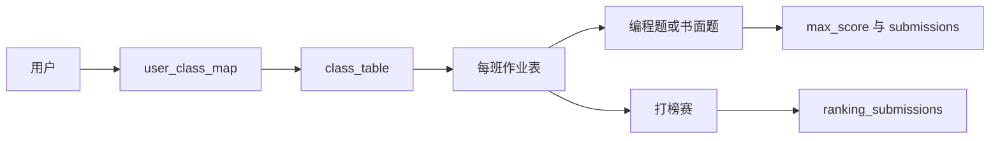
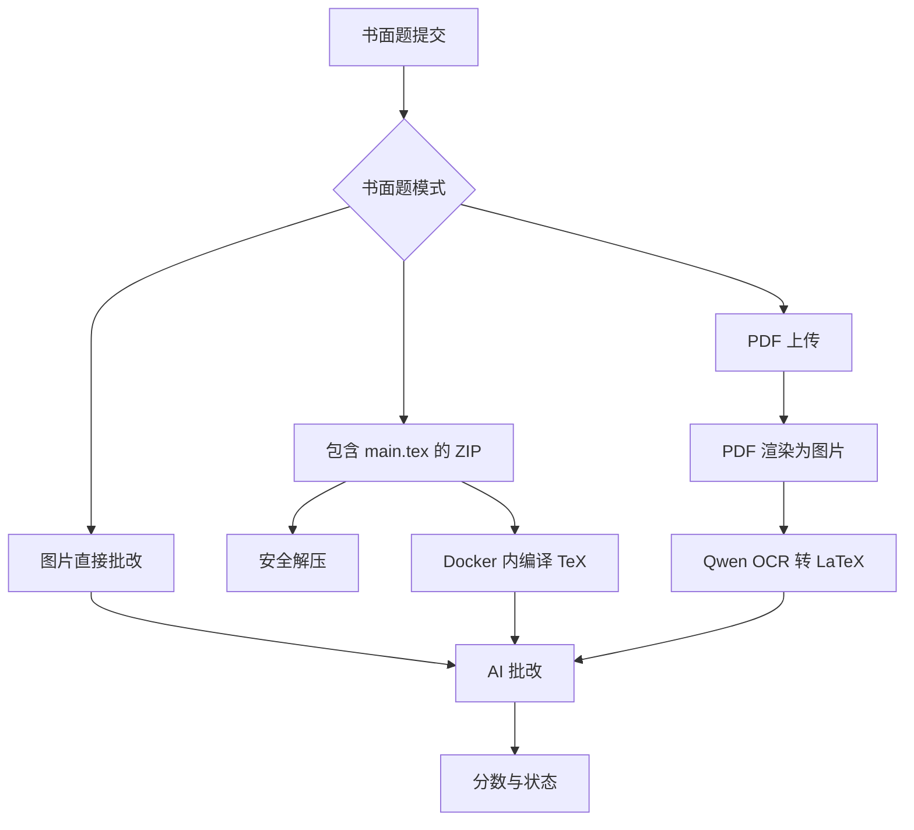

# 书面作业与课程管理

课程作业由班级、班级成员、每班作业表、普通编程/书面题，以及作为作业布置的打榜赛共同组成。班级成员关系主要存储在 `user_class_map`，并兼容旧的 `users.class` 字段。开启班级调整开关后，学生可以自行加入或退出班级；管理员可以添加/移除学生，并从 Excel 表格导入期末成绩。

来源:
- `oj_modules/routes/class_management_routes.py#L47-L123` 从 `.xlsx` 或 `.xls` 导入期末成绩。
- `oj_modules/routes/class_management_routes.py#L126-L170` 支持管理员把用户加入班级。
- `oj_modules/routes/class_management_routes.py#L173-L210` 移除用户并保护主班级关系。
- `oj_modules/routes/class_management_routes.py#L213-L237` 暴露当前用户班级列表。
- `oj_modules/routes/class_management_routes.py#L240-L360` 实现加入和退出班级。

管理员在 `homework_routes.py` 中管理作业。路由可以列出某班作业，添加题目或打榜赛作为作业项，更新截止时间，删除作业，并导出成绩。动态班级表总是用 `safe_table_name` 包裹。成绩导出会把普通题的 `max_score` 和打榜赛的 `ranking_submissions` 合并，按 GBK 输出 CSV 以兼容中文电子表格，并追加总分列。

来源:
- `oj_modules/routes/homework_routes.py#L57-L84` 加载班级作业并校验普通题。
- `oj_modules/routes/homework_routes.py#L98-L122` 从 `user_class_map` 加载学生，并兼容旧字段。
- `oj_modules/routes/homework_routes.py#L157-L191` 查询每个学生/题目的最佳提交。
- `oj_modules/routes/homework_routes.py#L404-L478` 添加题目或打榜赛作业项。
- `oj_modules/routes/homework_routes.py#L522-L695` 从普通题和打榜赛来源导出班级成绩。

书面作业由独立 Celery task 处理。它支持多种输入模式：图片直接 AI 批改、包含 TeX 工程的 ZIP、以及 PDF OCR 后再 AI 批改。任务使用幂等锁，先把提交设为 `Running`，把确定性输入错误和可重试错误分开处理，并把最终分数和状态写回数据库。TeX 编译在 Docker 沙箱中运行，并对 ZIP 解压和必需的 `main.tex` 做安全检查。

来源:
- `oj_modules/tasks/written_homework_tasks.py#L32-L41` 定义任务名和超时。
- `oj_modules/tasks/written_homework_tasks.py#L91-L177` 在 Docker 沙箱中编译 TeX。
- `oj_modules/tasks/written_homework_tasks.py#L245-L280` 安全解压 ZIP 提交。
- `oj_modules/tasks/written_homework_tasks.py#L321-L347` 获取幂等锁并设为 `Running`。
- `oj_modules/tasks/written_homework_tasks.py#L368-L374` 处理图片直接批改。
- `oj_modules/tasks/written_homework_tasks.py#L375-L489` 处理 ZIP/TeX 模式。
- `oj_modules/tasks/written_homework_tasks.py#L490-L558` 处理 PDF OCR、批改、收尾和错误。

AI 工具层承担书面作业所需的 OCR、图片转换、模型调用和结果解析。PDF 会被渲染成图片，不安全图片格式会被转换，图片批次会发送给 Qwen Omni/VL 类模型，评分结果会被解析为分数与反馈。同一模块也支持编程题图片输出批改，因此书面题和编程图片题共享类似的模型配置模式。

来源:
- `oj_modules/ai_utils.py#L67-L93` 定义书面作业和编程图片批改模型规格。
- `oj_modules/ai_utils.py#L568-L593` 把 PDF 渲染成图片。
- `oj_modules/ai_utils.py#L601-L623` 准备图片 data URL 并转换不安全格式。
- `oj_modules/ai_utils.py#L626-L714` 拆分和转写图片批次。
- `oj_modules/ai_utils.py#L717-L782` 把图片转写为 LaTeX。
- `oj_modules/ai_utils.py#L873-L928` 解析书面作业批改 JSON 与反馈。

人工批改和教师复核范围较窄但很关键。`grading_routes.py` 限制下载权限，只有提交者或管理员可以下载提交文件。管理员可以手动设置分数，并跳转到下一个待批改书面提交。当题目批改配置变化时，也有路由可以把该题待处理提交置为失效。

来源:
- `oj_modules/routes/grading_routes.py#L69-L96` 保护书面提交文件下载。
- `oj_modules/routes/grading_routes.py#L99-L121` 实现管理员人工批改。
- `oj_modules/routes/grading_routes.py#L124-L172` 查找下一个待批改书面提交。
- `oj_modules/routes/grading_routes.py#L175-L184` 使某题待处理提交失效。

作业导出还包含查重能力。代码会先去注释、折叠空白，再用 `SequenceMatcher` 在同一题下成对比较。个人代码库中的 include 文件也可以展开到查重语料中，因此直接提交代码和复制的辅助头文件都能纳入比较。

来源:
- `oj_modules/routes/homework_routes.py#L205-L221` 把代码库 include 文件展开到查重输入。
- `oj_modules/routes/homework_routes.py#L697-L742` 规范化代码并计算相似度。

