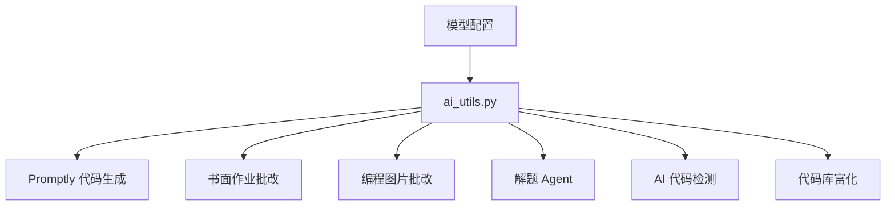
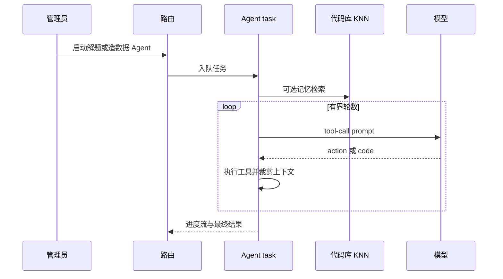

# AI与代码库智能

AI 能力主要集中在 `ai_utils.py` 和任务模块中。工具层负责解析模型凭据，支持 DashScope/OpenAI 兼容文本调用及 streaming fallback，处理图文对话，并规范化书面作业和编程图片批改结果。这样路由和 Celery task 不需要重复 provider 细节。同一套模型配置风格服务于 AI 导师反馈、Promptly、书面作业、Agent 解题、代码库富化和 AI 代码检测。

来源:
- `oj_modules/ai_utils.py#L148-L177` 校验凭据并解析 endpoint。
- `oj_modules/ai_utils.py#L215-L295` 通过 OpenAI SDK 和 requests fallback 调用文本模型。
- `oj_modules/ai_utils.py#L785-L870` 调用图文聊天模型。
- `oj_modules/ai_utils.py#L972-L1053` 提供编程图片批改和书面作业批改入口。
- `config.py#L39-L58` 定义 DashScope 与 Qwen 模型配置。

面向管理员的解题 Agent 是多轮 ReAct 风格循环。它先确认题目是编程题且用户是管理员，初始化 workspace，可选注入代码库 KNN 记忆，强制执行 `AGENT_MAX_ROUNDS`，裁剪上下文，记录 API 请求，并用 Qwen coder tool call 迭代。生成测试数据 Agent 遵循相似框架，但要求存在标准代码，并在更严格的 prompt 和提交限制下生成额外测试点。

来源:
- `oj_modules/tasks/agent_solve_task.py#L24-L63` 初始化 Agent 状态并校验管理员/编程题权限。
- `oj_modules/tasks/agent_solve_task.py#L92-L145` 创建 workspace 并注入代码库 KNN 记忆。
- `oj_modules/tasks/agent_solve_task.py#L160-L213` 强制轮数上限并裁剪上下文。
- `oj_modules/tasks/agent_solve_task.py#L215-L257` 执行 Qwen coder tool call。
- `oj_modules/tasks/agent_generate_testdata_task.py#L19-L60` 限制测试点数量并校验管理员/题目状态。
- `oj_modules/tasks/agent_generate_testdata_task.py#L110-L181` 运行严格 prompt、轮数上限、上下文裁剪和模型请求。

个人代码库允许用户存放 C/C++ 头文件和源文件，并在评测时通过 `#include` 使用。路由会在保存或上传时校验文件名、扩展名和大小。学生提交代码时，include 展开可以加载引用文件；用户请求建立索引时，Celery task 会转交给 `repository_index_services.py`。

来源:
- `oj_modules/routes/repository_routes.py#L49-L84` 列出代码库文件。
- `oj_modules/routes/repository_routes.py#L114-L170` 校验并保存文件。
- `oj_modules/routes/repository_routes.py#L197-L243` 校验上传。
- `oj_modules/routes/repository_routes.py#L245-L340` 启动全量或单文件索引任务。
- `oj_modules/repository_services.py#L9-L44` 提取 include 并加载用户代码库文件。
- `oj_modules/tasks/repository_index_tasks.py#L7-L18` 把代码库索引封装为 Celery task。

代码库索引不是简单 embedding。它会创建/迁移索引 job 表，用 tree-sitter 和 recovery 逻辑解析代码，通过 Qwen 结构化补充函数/类摘要，把名称、签名、摘要、参数、返回值、类上下文和代码组合成 embedding 输入，归一化向量，把代码块和二进制 embedding 写入 MySQL，并用原子写和元数据一致性检查维护 FAISS 文件。

来源:
- `oj_modules/repository_index_services.py#L85-L133` 创建并迁移索引 job 表。
- `oj_modules/repository_index_services.py#L972-L1302` 用 tree-sitter 与 recovery 逻辑抽取类和函数。
- `oj_modules/repository_index_services.py#L1354-L1419` 用 Qwen 富化代码块元数据。
- `oj_modules/repository_index_services.py#L1765-L1834` 校验 embedding provider 并调用 DashScope embedding。
- `oj_modules/repository_index_services.py#L1876-L1897` 构造 embedding 输入文本。
- `oj_modules/repository_index_services.py#L1900-L1997` 管理 FAISS 文件并重置存储。
- `oj_modules/repository_index_services.py#L2145-L2235` 插入类、函数块和 embedding。
- `oj_modules/repository_index_services.py#L2271-L2520` 运行全量/单文件索引 job。
- `oj_modules/repository_index_services.py#L2700-L2826` 查询 FAISS-backed 代码块。

AI 代码检测融合 LLM 分和行为分。最终分数按 `min(1.0, llm_score + behavior_score * 0.3)` 截断，再分为高、中、低风险。Celery task 支持单个检测或按题目/用户过滤的批量检测，会跳过非 MATLAB 或非编程提交，并同时更新 Redis 进度 tracker 与数据库结果行。

来源:
- `oj_modules/ai_detection/detector.py#L15-L29` 定义分数融合和风险阈值。
- `oj_modules/ai_detection/detector.py#L32-L108` 构造结果结构、执行 LLM/行为检测并融合分数。
- `oj_modules/tasks/ai_detection_tasks.py#L27-L81` 定义 task 名和批量进度行为。
- `oj_modules/tasks/ai_detection_tasks.py#L84-L165` 执行单个和批量检测，包括跳过规则。

