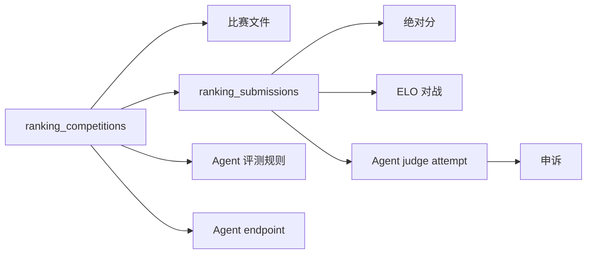
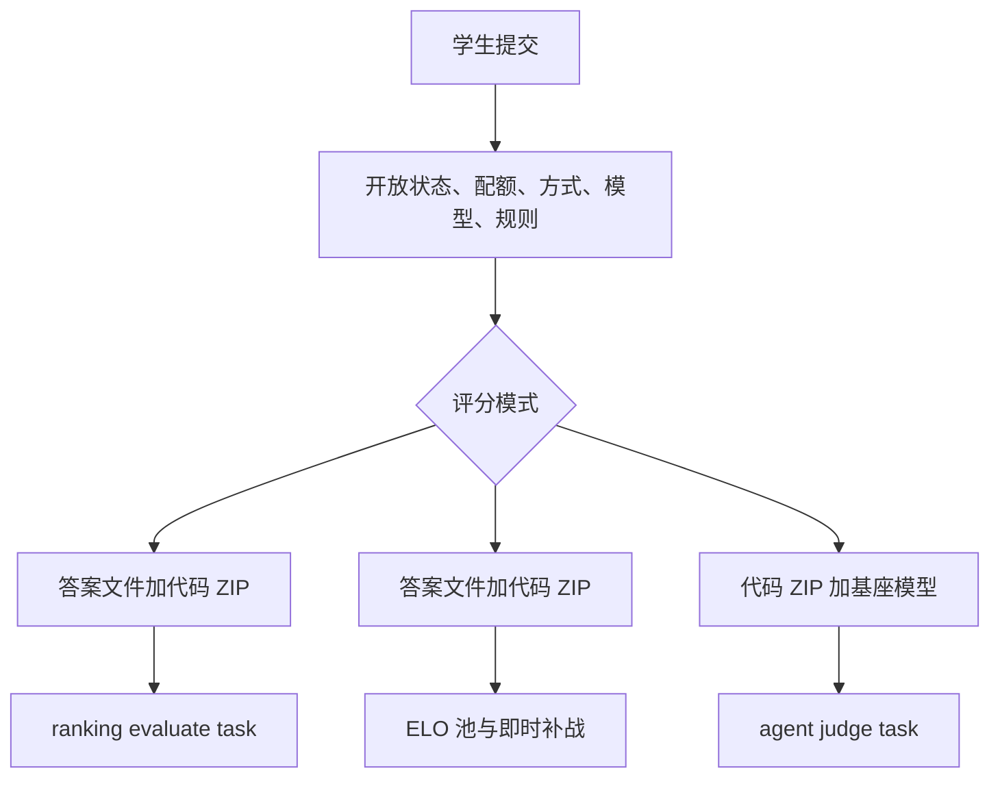

# 打榜赛

打榜赛是独立于普通作业题的产品面。它用 `ranking_db.py` 管理 schema 创建、迁移、文件路径、提交配额、比赛 CRUD、榜单查询、ELO 状态、申诉、Agent-as-Judge 配置和文件元数据。数据模型支持答案文件、代码 ZIP、比赛附件、参考数据、评分脚本、提交窗口、Git 提交方式和 48 小时提交次数限制。

来源:
- `oj_modules/ranking_db.py#L3-L10` 描述打榜赛 DB 层。
- `oj_modules/ranking_db.py#L24-L55` 定义上传子目录和配额窗口 helper。
- `oj_modules/ranking_db.py#L58-L86` 创建 `ranking_competitions` 表。
- `oj_modules/ranking_db.py#L99-L180` 迁移 ELO、Agent-as-Judge、endpoint、模式和提交限制列。
- `oj_modules/ranking_db.py#L181-L230` 创建提交方式、文件和提交表。
- `oj_modules/ranking_db.py#L292-L336` 创建 ELO 对战和申诉表。

打榜赛路由支持说明、提交、榜单、对战、全部提交、申诉、编辑和批量评测等 tab。提交通道会检查比赛开放状态、评分模式、提交方式、模型 endpoint 是否就绪、评测规则、限流和窗口配额。普通绝对分/ELO 模式要求同时上传答案文件和代码 ZIP。Agent-as-Judge 模式只需要代码 ZIP，但要求模型和规则已配置。Git 提交方式有独立的仓库检查和确认提交流程。

来源:
- `oj_modules/routes/ranking_routes.py#L104-L128` 声明 tab、大小限制和支持的评分/答案模式。
- `oj_modules/routes/ranking_routes.py#L162-L226` 计算 endpoint readiness 和提交阻塞原因。
- `oj_modules/routes/ranking_routes.py#L557-L718` 构建比赛详情页和 tab 上下文。
- `oj_modules/routes/ranking_routes.py#L1120-L1287` 实现绝对分、ELO 和 Agent-as-Judge 的 ZIP/答案提交。
- `oj_modules/routes/ranking_routes.py#L1319-L1360` 实现 Git 仓库检查和 Git 提交入口。

绝对分评分围绕确定性的评分脚本契约。task 会验证提交和比赛，定位上传答案、参考数据和评分脚本，执行 `python script user_answer reference max_score`，期望 stdout 输出 JSON，随后截断分数并写入 Accepted 或 Error。ELO 评分是对战式：周期调度器选择提交对，评分脚本返回 winner，任务在锁内按 expected-score 公式更新 rating。

来源:
- `oj_modules/tasks/ranking_evaluate_tasks.py#L3-L8` 描述标准答案评分。
- `oj_modules/tasks/ranking_evaluate_tasks.py#L35-L85` 定义评分脚本契约和 JSON stdout。
- `oj_modules/tasks/ranking_evaluate_tasks.py#L88-L155` 校验输入、截断分数并写状态。
- `oj_modules/tasks/ranking_elo_tasks.py#L3-L23` 描述 scheduler、脚本契约、锁和即时补战。
- `oj_modules/tasks/ranking_elo_tasks.py#L88-L106` 实现 ELO expected/new rating。
- `oj_modules/tasks/ranking_elo_tasks.py#L148-L192` 定义 ELO 评分脚本契约。
- `oj_modules/tasks/ranking_elo_tasks.py#L235-L360` 运行对战并调度初始补战。

Agent-as-Judge 在预构建 Docker 镜像中评测提交，该镜像包含 Agent CLI 和工具链。`ranking_agent_judge.py` 中的纯逻辑负责规范化编排模式、校验 DAG 规则、计算拓扑顺序和有效结果、解析 JSONL 结果行、渲染安全 Markdown/Math HTML，并生成 prompt。Celery task 会准备包含题面、附件、规则和结果文件的 workspace；用 Redis slot 限制选择 endpoint；运行 `docker run`；通过 `run_harness` 调用 Claude、Codex 或 opencode；读取结果；发布进度快照；最后计算有效分。

来源:
- `oj_modules/ranking_agent_judge.py#L20-L112` 规范化编排模式并校验/拓扑排序规则 DAG。
- `oj_modules/ranking_agent_judge.py#L115-L181` 计算有效结果、解析 result JSONL 并构造 `rules.json`。
- `oj_modules/ranking_agent_judge.py#L217-L340` 渲染安全 HTML，并为 single/topological 模式生成 prompt。
- `oj_modules/tasks/ranking_agent_judge_tasks.py#L49-L67` 读取带环境变量优先级的配置。
- `oj_modules/tasks/ranking_agent_judge_tasks.py#L276-L320` 选择 endpoint 并应用 Redis slot 限制。
- `oj_modules/tasks/ranking_agent_judge_tasks.py#L700-L779` 准备 workspace 和 Docker run 参数。
- `oj_modules/tasks/ranking_agent_judge_tasks.py#L804-L872` 执行 harness phase 并读取结果文件。
- `oj_modules/tasks/ranking_agent_judge_tasks.py#L923-L1152` 实现 single-container 和 topological 执行。
- `oj_modules/tasks/ranking_agent_judge_tasks.py#L1155-L1360` 收尾分数并注册 task。

Docker 镜像是一个较重的运行包。它包含工具链、数值库、Octave/TeX/OCR/browser 栈、Python 科学包和 Agent CLI。`run_harness` 脚本按环境变量选择 harness，并为 Codex、opencode 或 Claude Code 写入对应配置。修改 `docker/agent_judge/*` 后，生产部署需要在服务器上重建镜像。

来源:
- `docker/agent_judge/Dockerfile#L1-L4` 记录构建命令和基础镜像。
- `docker/agent_judge/Dockerfile#L19-L31` 安装工具链、数值库、Octave 和 TeX。
- `docker/agent_judge/Dockerfile#L37-L90` 安装 OCR/ML/browser/Python 包。
- `docker/agent_judge/Dockerfile#L92-L104` 安装 Agent CLI 并复制 harness 脚本。
- `docker/agent_judge/run_harness#L117-L251` 配置并分发 Codex、opencode 或 Claude harness。

