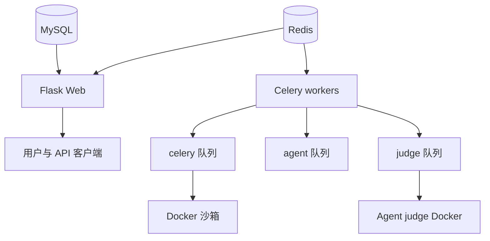
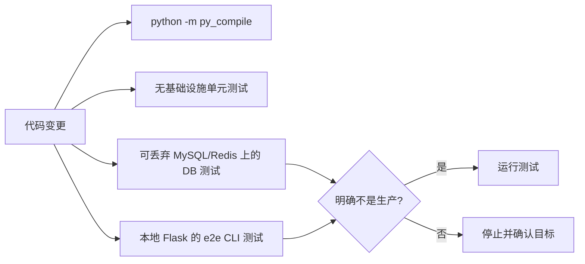

# 运维测试与工具链

本地启动需要 Redis、MySQL、Flask Web 进程和 Celery worker 组。README 说明了数据库初始化、依赖安装、配置修改、可选轻量 Agent-as-Judge 镜像构建，以及 supervisord 启动。Web 进程监听 2025 端口。Celery 队列隔离是运行时契约的一部分：`celery` 处理普通评测，`agent` 以低并发处理 AI Agent，`judge` 处理 Agent-as-Judge Docker 任务。

来源:
- `README.md#L40-L67` 列出进程和环境需求。
- `README.md#L69-L148` 记录数据库初始化、配置、Docker lite 镜像、supervisord 启动和 localhost 访问。
- `celery.conf#L6-L35` 定义三个 worker program 和队列。
- `web.conf#L6-L13` 定义 Web 进程。
- `oj.py#L218-L232` 配置 Celery 路由和 late-ack 行为。

生产部署是有意保持手工且保守的。代码从本地同步到 `why-server:/home/ebola/oj/`，rsync 命令排除敏感或生产专有路径。Python/config 变更需要重启两个应用 supervisord 组；只有模板或客户端资源变更时，可以直接拷贝文件而不重启，因为模板会热加载。生产的 `config.py` 和 `static/` 不能被覆盖。修改 Agent-as-Judge 镜像内容后，需要在服务器上重新构建 Docker 镜像。

来源:
- 项目说明 `AGENTS.md` 的 "Deployment to why-server" 定义 rsync、supervisord 重启顺序和前端 fast path。
- 项目说明 "Remote files that must NOT be overwritten" 标记生产 `static/` 和 `config.py`。
- 项目说明 "Agent-as-Judge image" 定义 Docker 镜像重建规则。
- `README.md#L131-L148` 描述本地 supervisord 启动。

测试按风险拆分。仓库有 unit、DB、e2e 和 CI 基础设施。unit 包含无外部服务的 judger/security/grading/sandbox 检查；DB 和 e2e 需要可丢弃的 MySQL/Redis；CI 容器脚本明确不使用生产配置、跳过 live AI，并按模块运行。项目的数据安全边界非常强：测试不能在生产主机上运行，也不能指向生产 MySQL/Redis，因为 fixture 会清空和重建表。

来源:
- `pytest.ini#L1-L11` 定义测试路径、timeout 和 marker。
- `tests/conftest.py#L32-L42` 列出 fixture 重置的核心表。
- `tests/conftest.py#L83-L121` 导入 schema 并确保兼容列。
- `tests/conftest.py#L134-L184` flush Redis、truncate/drop 表并种子班级/admin。
- `tests/conftest.py#L189-L230` 标记 infra-free unit，并为它们跳过 DB reset。
- `tests/conftest.py#L247-L293` mock AI、SMTP 和 embedding。
- `tests/ci/README.md#L1-L6` 描述隔离 CI 基础设施和生产主机禁令。
- `tests/ci/run-ci.sh#L1-L36` 在 `/app` 中运行、避免生产配置、跳过 live AI 并输出 JUnit XML。

仓库还带有用于端到端交互的 Codex/Claude 风格 CLI skills。`numoj-admin` 和 `numoj-user` 只驱动真实 HTTP 路由和 JSON API，不 import 源码，也不直接碰 DB/Redis。因此在本地 disposable 服务运行时，它们适合 e2e workflow 和手工 smoke check。JSON API 层的一部分作用就是稳定支撑这些 skill：题目、打榜赛、代码库、论坛、作业、提交和 AI 检测 endpoint 都返回带公开字段过滤的结构化 payload。

来源:
- `skills/numoj-admin/SKILL.md#L8-L9` 说明管理员 CLI 只使用 HTTP/JSON API。
- `skills/numoj-admin/SKILL.md#L34-L64` 定义管理员 workflow 和命令范围。
- `skills/numoj-user/SKILL.md#L8-L9` 说明用户 CLI 只使用 HTTP/JSON API。
- `skills/numoj-user/SKILL.md#L34-L58` 定义用户 workflow 和命令范围。
- `oj_modules/api/__init__.py#L4-L22` 注册 API 蓝图。

运维上最重要的边界是数据安全。任何会 reset 表、导入 SQL、迁移生产数据、修复记录或运行 e2e 流程的操作，都必须先证明目标是本地或可丢弃基础设施。只读生产检查可以接受，但写操作需要用户明确批准和回滚计划。应用本身也反映了这种姿态：集中配置、避免同步生产 secrets，并让新的运行时加固参数优先通过环境变量或默认值读取。

来源:
- 项目说明 "Data safety boundary" 定义生产主机禁测和数据写入审批规则。
- `config.py#L5-L24` 加载可选 `.env`，同时保留 `config.py` 作为主模板。
- `config.py#L104-L128` 让新的 Agent-as-Judge 和 judger 参数有默认可配置值。

